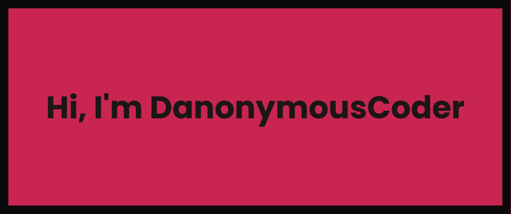

  
Hi there 👋, My name is Ridwanullah popularly known as DanonymousCoder.
- 🔭 I’m currently working on a Recycle website ...
- 🌱 I’m currently learning JavaScript ...
- 👯 I’m looking to collaborate on Web development projects ...

<!--
**DanonymousCoder/DanonymousCoder** is a ✨ _special_ ✨ repository because its `README.md` (this file) appears on your GitHub profile.

Here are some ideas to get you started:

- 🔭 I’m currently working on a Recycle websit ...
- 🌱 I’m currently learning JavaScript ...
- 👯 I’m looking to collaborate on Web development projects ...
- 🤔 I’m looking for help with ...
- 💬 Ask me about ...
- 📫 How to reach me: ...
- 😄 Pronouns: ...
- ⚡ Fun fact: ...
-->
<h3 align="left">Connect with me:</h3>

<a href="https://twitter.com/DanonymousCoder" target="blank">@DanonymousCoder</a>
  

  

&nbsp;

